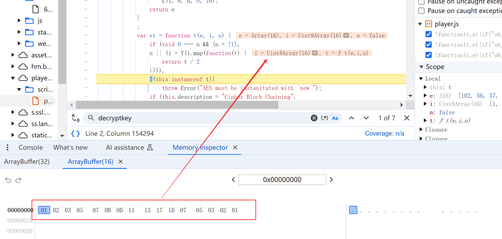

# 以`x铅笔`为例逆向分析`Polyv`的`m3u8`加密技术

 yuanhongyi 

Tag：`AES128-encrypted m3u8` `蓝铅笔` `Polyv`

> 前排提示：Polyv版本 /*! Polyv Vod Player Desktop 1.58.0 */

我的一位朋友在某绘画学习网站购买了一些网课，这些课程只能在网站上观看，不能下载。她想把这些课程下载下来，而网站上的视频是加密的，无法用IDM直接下载。

## m3u8分析

`F12`> `Network` 观察到有接收到m3u8文件

第一个对应清晰度选择，有三种清晰度

第二个则是真正的m3u8文件，观察到ts文件有AES-128加密，key和iv貌似给出了

**事情真的有这么简单吗？拿给普通m3u8下载器下载，会提示key下载错误**

用浏览器访问m3u8里key的url，则会提示`400 Bad Request`

看来key的url并非用m3u8文件给出的url

在`network`里搜索key，果然找到了`key`的请求，果然请求链接后面带了token，但是事情并没有结束，因为这个key居然是32byte的

很可能key也进行了加密，果然，把key在m3u8文件中的url替换为，真正的url还是下载失败

上网搜索`m3u8 32byte key`果然有相关结果，那阅读js源码会轻松许多

https://www.52pojie.cn/thread-1574013-1-1.html
https://www.52pojie.cn/thread-1585958-1-1.html

> 根据论坛上的经验贴，16byte key是32byte key通过AES解密而来，密钥由`vidjson`的`seed_const`经过md5加密取前16位得到，iv则是固定的
而`vid.json`的`body`又用AES加密了，密钥是`vid`md5加密取前16位，iv则后16位
所以如果Polyv没有更换加密方式，那么就可以按照帖子来搞   
顺序为: json解密 > key解密

## js源码

### json解密

搜索`json`，果然有，并且是密文

观察m3u8文件的调用，打开`player.js`源码，搜索`decryptVideoJson`,可以看到完全符合经验贴说的

> 在return打断点可以更清楚看到，e是vid，i是md5，n和r对其做了切分变成key和iv，a是密文转变成的数组，并且是str to hex直接转的数组，对应到python里应该用`bytes.fromhex`,o是解密后的byte数组，s是o通过utf-8编码转换成的base64字符串

那么我们就可以用python脚本来解密json，脚本我上传到了仓库里，这里我偷个懒，直接在控制台打断点hook出解密后的变量

丢到在线base64转换网站，可以得到json，进而得到`seed_const`

## key解密

搜索`decryptkey`，找到如下源码

打断点知道，`n`是从`t`的key-url那里拿到key，放在ArrayBuffer中，`r`是`seed_const`经过md5加密得到的字符出串，`a`取`r`的前16位转化为byte数组，`o`是从Buffer提取为Array数组，随后经过断点那一行的执行，真正的key就赋值给了`n`

进入函数`bt.m.c(a,P)`，我们可以发现，虽然P是个常数数组，但是在函数中进一步被处理，才得到最终的iv: `01020305070B0D1113171D0705030201`

比较有意思的是，最后l和n的顺序有些不一样，l在这一行对顺序做了改变
以2byte为单位，"大小端进行了转换"，我也不知道这样做的意义是什么？

至此，key解密完毕，最终的key为`C79484DBEC26149A49DE6DE1109A37B3`

## 更快的获得key

https://blog.weimo.info/archives/599/

该文章指出，搜索`decryptdata`，在最后一个结果打断点可以直接得到key

不过令我费解的是，为何最后的key每2byte要交换端序存储

**完结撒花！**

